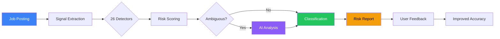
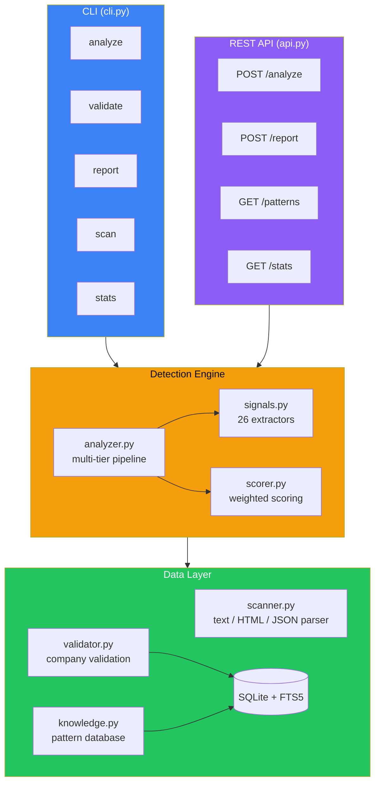

<!-- markdownlint-disable MD033 MD041 -->
<div align="center">

# JobSentinel

[](https://www.python.org/downloads/)
[](#development)
[](LICENSE)
[](https://github.com/astral-sh/ruff)

**AI-powered LinkedIn job scam detection and validation platform.**

*Protect yourself from fake listings, ghost jobs, and recruitment fraud before you apply.*

</div>

---

## Why JobSentinel?

Job scams cost victims **$2 billion+ annually** (FTC, 2024). LinkedIn's own moderation catches obvious fakes, but sophisticated scams — MLM recruitment disguised as corporate roles, ghost jobs that waste months of your time, data harvesting posts that steal your identity — slip through.

JobSentinel catches what platforms miss by analyzing **40+ scam signals** across 5 categories, cross-referencing company data, and escalating ambiguous cases to AI for deeper analysis.

## How It Works



**Three-stage pipeline:**

| Stage | Speed | What It Does |
|-------|-------|-------------|
| Signal extraction | < 10ms | 26 pattern detectors scan for red flags, warnings, ghost job indicators |
| Risk scoring | < 1ms | Weighted signal combination produces a 0–1 probability score |
| AI escalation | ~2s | Claude analyzes ambiguous cases (mid-range scores) for nuanced judgment |

> Most scams are caught at stage 1 — AI is only invoked for the ~15% of postings that land in the gray zone.

## Quick Start

```bash
pip install -e .

# Initialize with default scam pattern database
sentinel init --seed

# Analyze a suspicious posting
sentinel analyze "We're hiring! No experience needed. Earn $5000/week guaranteed. Send $50 registration fee to start."

# Analyze a batch of jobs from a file
sentinel analyze --file jobs.json

# Validate a company
sentinel validate "Google"

# Report a scam (improves detection for everyone)
sentinel report "https://linkedin.com/jobs/view/123" --reason "Asked for SSN before interview"

# View detection accuracy statistics
sentinel stats
```

### Install Options

```bash
pip install -e ".[full]"    # Everything: AI + API server + web scraping
pip install -e ".[ai]"      # Just AI analysis (anthropic)
pip install -e ".[api]"     # Just API server (fastapi + uvicorn)
pip install -e ".[web]"     # Just web scraping (httpx + beautifulsoup4)
```

## Features

### 26 Signal Detectors Across 5 Categories

<details>
<summary><strong>Red Flags (9)</strong> — High-confidence scam indicators</summary>

| Signal | What It Catches |
|--------|----------------|
| Upfront payment | "Pay $99 registration fee to start" |
| Personal info request | SSN, bank account before interview |
| Guaranteed income | "$5,000/week guaranteed" |
| Suspicious email | Corporate role but gmail/yahoo contact |
| Crypto payment | "Paid in Bitcoin/crypto" |
| No company presence | No LinkedIn page, < 10 employees |
| Interview bypass | "No interview needed, start immediately" |
| MLM language | "Build your team", "unlimited earning potential" |
| Reshipping scam | "Receive and forward packages" |

</details>

<details>
<summary><strong>Warnings (9)</strong> — Moderate-confidence indicators</summary>

| Signal | What It Catches |
|--------|----------------|
| Salary anomaly | Pay significantly above market rate |
| Vague description | "Various duties as assigned" |
| No qualifications | No skills or experience listed |
| Urgency language | "Apply NOW! Limited spots!" |
| WFH unrealistic pay | Remote + unrealistic compensation |
| Low recruiter connections | Recruiter with < 50 LinkedIn connections |
| Phone anomaly | Non-standard contact numbers |
| Compensation red flags | Unusual payment structures |
| Suspicious company name | Generic names like "Global Opportunities LLC" |

</details>

<details>
<summary><strong>Ghost Job (2)</strong> — Stale or phantom postings</summary>

| Signal | What It Catches |
|--------|----------------|
| Stale posting | Posted 30+ days with no activity |
| Repost pattern | Same role reposted monthly |

</details>

<details>
<summary><strong>Structural (3)</strong> — Formatting and content quality</summary>

| Signal | What It Catches |
|--------|----------------|
| Grammar quality | Poor grammar, spelling errors |
| Suspicious links | bit.ly, telegram, personal URLs |
| AI-generated content | Detects AI-written boilerplate |

</details>

<details>
<summary><strong>Positive (2)</strong> — Legitimacy indicators that reduce score</summary>

| Signal | What It Catches |
|--------|----------------|
| Established company | 1000+ employees, verified LinkedIn page |
| Detailed requirements | Specific skills, qualifications, experience |

</details>

### Risk Classification

| Score | Level | Badge | Action |
|-------|-------|-------|--------|
| 0.0–0.2 | Safe | :green_circle: | Proceed with confidence |
| 0.2–0.4 | Low | :green_circle: | Likely legitimate, minor flags |
| 0.4–0.6 | Suspicious | :yellow_circle: | Review warnings before applying |
| 0.6–0.8 | High | :orange_circle: | Strong scam indicators — investigate |
| 0.8–1.0 | Scam | :red_circle: | Almost certainly fraudulent |

### Company Validation

Cross-reference companies against multiple sources:

- **Known employers database** — 200+ verified major employers
- **Domain WHOIS** — Check domain age (new domains = higher risk)
- **LinkedIn company page** — Verify follower count, employee count
- **Result caching** — 7-day TTL, `--refresh` to force re-check

### Browser Extension (Chrome)

Analyze LinkedIn job postings directly in your browser:

```bash
# Load the extension in Chrome developer mode
# Navigate to: chrome://extensions → Load unpacked → sentinel/web/extension/

# Start the API server (required for the extension)
sentinel serve --port 8080
```

The extension injects a color-coded risk badge next to each job title and shows detailed signal breakdown in a popup.

## REST API

```bash
pip install -e ".[api]"
sentinel serve --port 8080
# API docs at http://localhost:8080/docs
```

### Endpoints

#### `POST /api/analyze` — Analyze a job posting

```bash
curl -X POST http://localhost:8080/api/analyze \
  -H "Content-Type: application/json" \
  -d '{"text": "Earn $5000/week guaranteed! Send $50 fee to start.", "title": "Data Entry", "company": ""}'
```

```json
{
  "scam_score": 0.95,
  "risk_level": "scam",
  "risk_label": "Almost Certainly Scam",
  "red_flags": [
    {"name": "upfront_payment", "detail": "Registration/training fee required"},
    {"name": "guaranteed_income", "detail": "Unrealistic income guarantee"}
  ],
  "warnings": [
    {"name": "vague_description", "detail": "No specific duties listed"}
  ],
  "signal_count": 7,
  "analysis_time_ms": 4.2
}
```

#### `POST /api/report` — Submit a scam report

```bash
curl -X POST http://localhost:8080/api/report \
  -H "Content-Type: application/json" \
  -d '{"url": "https://linkedin.com/jobs/view/123", "is_scam": true, "reason": "Asked for payment"}'
```

#### `GET /api/patterns` — List detection patterns

```bash
curl http://localhost:8080/api/patterns?category=red_flag
```

#### `GET /api/stats` — Detection statistics

#### `GET /api/health` — Service health check

## Architecture



```
sentinel/
├── models.py      — Data classes (JobPosting, ScamSignal, ValidationResult)
├── signals.py     — 26 signal extractors across 5 categories
├── scorer.py      — Weighted signal scoring engine
├── analyzer.py    — Multi-tier analysis pipeline (pattern matching → AI)
├── scanner.py     — Job posting parser (text, HTML, JSON)
├── validator.py   — Company validation (LinkedIn, WHOIS, known companies)
├── config.py      — TOML configuration loading
├── knowledge.py   — Pattern knowledge base with 20+ default scam patterns
├── db.py          — SQLite + FTS5 persistence
├── cli.py         — Click CLI
├── api.py         — FastAPI REST API
└── web/extension/ — Chrome browser extension
```

## Design Decisions

| Decision | Why |
|----------|-----|
| **Stdlib-first runtime** | Core detection runs without any pip packages — zero supply chain risk for the scoring engine |
| **Multi-tier over single-model** | 85% of scams caught by fast regex signals (< 10ms). AI is expensive; only invoke it for genuinely ambiguous cases |
| **Weighted signals, not rules** | Binary "scam or not" flags miss nuance. Weighted combination lets multiple weak signals accumulate into high confidence |
| **Privacy-first** | No LinkedIn credentials stored. Analysis works on posting text, not account data |
| **Offline-capable** | Company validation caches results for 7 days. Signal extraction and scoring work completely offline |

## Development

### Testing

```bash
# Install with dev dependencies
pip install -e ".[dev,full]"

# Run full test suite
python -m pytest tests/ -v

# Run with coverage
python -m pytest tests/ --cov=sentinel --cov-report=term-missing

# Run specific test module
python -m pytest tests/test_security.py -v

# Lint
ruff check sentinel/
```

**227 tests** across 10 test files covering:

| Test File | What It Covers |
|-----------|---------------|
| `test_core.py` | Models, signals, scorer, scanner, validator, DB, knowledge |
| `test_advanced.py` | Innovation engine, ecosystem integration |
| `test_security.py` | Input validation, injection prevention, HTML sanitization |
| `test_flywheel_integration.py` | Learned weight propagation, full scoring loop |
| `test_config.py` | TOML config loading, defaults, singleton |
| `test_schema_and_dates.py` | DB schema migration, date format parsing |
| `test_company_cache.py` | Validation caching, TTL expiry, refresh |
| `test_batch.py` | Batch file analysis, JSON output |

### Security

- Input validation on all API fields (length limits, URL format)
- SQL injection prevention (parameterized queries throughout)
- Command injection prevention (domain validation before subprocess calls)
- HTML sanitization (script/style/event handler stripping)
- See `tests/test_security.py` for the full security test suite

## Configuration

JobSentinel can be configured via TOML:

```toml
# ~/.config/sentinel/config.toml

db_path = "~/.sentinel/sentinel.db"
ai_enabled = true
ai_model = "claude-haiku-4-5"
ai_model_deep = "claude-sonnet-4-6"
rate_limit_rpm = 60
cors_origins = ["http://localhost:3000"]
log_level = "INFO"
```

## Contributing

1. Fork the repo
2. Create a feature branch (`git checkout -b feature/amazing-signal`)
3. Write tests for your changes
4. Run the test suite (`python -m pytest tests/ -v`)
5. Run the linter (`ruff check sentinel/`)
6. Submit a PR

**Adding a new signal detector:**

1. Add your detector function in `sentinel/signals.py` following the existing pattern
2. Add it to the `ALL_SIGNALS` list
3. Add a corresponding pattern in `sentinel/knowledge.py` `_DEFAULT_PATTERNS`
4. Write tests in `tests/`

## Dependencies

| Dependency | Purpose | Required? |
|-----------|---------|-----------|
| Python 3.12+ | Runtime | Yes |
| `click` | CLI framework | Yes |
| `anthropic` | AI analysis tier | Optional (`pip install .[ai]`) |
| `fastapi` + `uvicorn` | REST API server | Optional (`pip install .[api]`) |
| `httpx` | URL fetching, company validation | Optional (`pip install .[web]`) |
| `beautifulsoup4` | HTML parsing | Optional (`pip install .[web]`) |

Core detection runs on **Python stdlib only** — no pip packages required for the signal extraction and scoring engine.

## License

MIT
